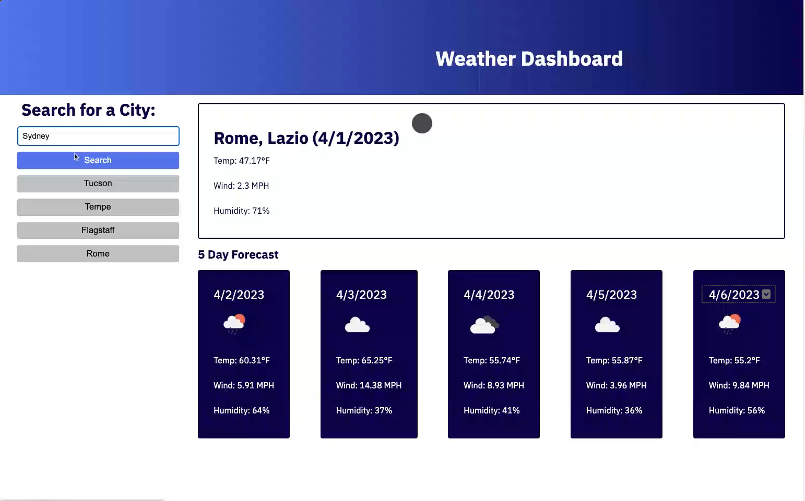

# weather-dashboard

App for that allows a user to see the weather outlook for multiple cities. Given a city the current weather and 5 day forecast are displayed.

# Webpage
Link to Deployed Application;
https://tasshroll.github.io/weather-dashboard/

Link to GitHub repository:
https://github.com/tasshroll/weather-dashboard

# Screenshot
SCREENSHOTS of application

VIDEO of usage
]

(https://www.youtube.com/watch?v=eeQ1YPAlEs0)

## Description
Using, OpenWeather API, this app makes 3 calls to retrieve weather data. Data is displayed and stored in 'localStorage' and. When user selects a previously stored city, the app will retreive the data for display. The app runs in the browser and features dynamically updated HTML and CSS, powered by JavaScript.

Three calls:
1) 1st fetch to Geocoding API described at https://openweathermap.org/api/geocoding-api 
with city name. API returns latitude/longitude
Call: http://api.openweathermap.org/geo/1.0/direct?q={city name},{state code},{country code}&limit={limit}&appid={API key}

2) 2nd fetch to API described at https://openweathermap.org/current
with lat/long data. API eturns current weather
     Call:  //https://api.openweathermap.org/data/2.5/forecast?lat={lat}&lon={lon}&appid={API key}

3) 3rd fetch to API described at https://openweathermap.org/forecast5 returns forecast data
    Call: //https://api.openweathermap.org/data/2.5/weather?lat={lat}&lon={lon}&appid={API key}

## User Story

AS A traveler
I WANT to see the weather outlook for multiple cities
SO THAT I can plan a trip accordingly

## Acceptance Criteria

GIVEN a weather dashboard with form inputs
WHEN I search for a city
THEN I am presented with current and future conditions for that city and that city is added to the search history
WHEN I view current weather conditions for that city
THEN I am presented with the city name, the date, an icon representation of weather conditions, the temperature, the humidity, and the wind speed
WHEN I view future weather conditions for that city
THEN I am presented with a 5-day forecast that displays the date, an icon representation of weather conditions, the temperature, the wind speed, and the humidity
WHEN I click on a city in the search history
THEN I am again presented with current and future conditions for that city

## Other

- What was your motivation and what did you learn? 
Motivated to build an application that:
- uses event listeners
- 3 different API calls to Open Weather
- retreival of data from API into local weather object
- localStorage used with JSON parse and stringify
- dynamically created HTML for forecast cards
- use dayjs for current date

- What did you learn?
I learned about API calls and retreival of data. I made extensive use of dev tools to locate the data needed to display weather.

## Usage
Enter a button in the form input and click "Search".
If nothing is displayed, API data returned was empty for that city. Try again.

## Credits
Ask BCS, tutor, prior CSS code from student activity

## License
Please refer to the LICENSE in the repo.

